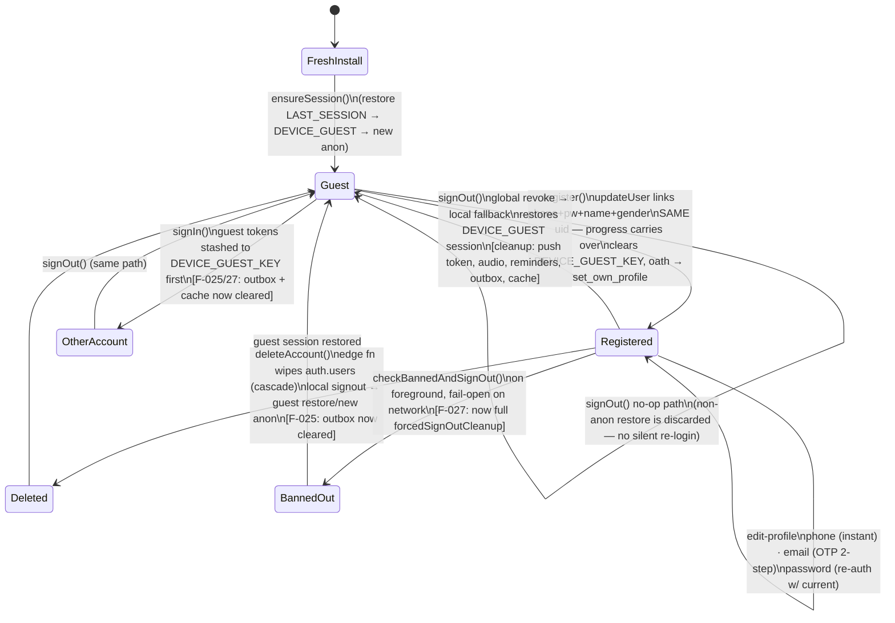

# Phase 3 report — Auth & identity (client side)

**Branch:** `audit/phase-3-auth` (stacked on `audit/phase-0-baseline`)
**Scope audited:** `app/(auth)/{sign-in,register,reset-password}.tsx`, `app/(auth)/_layout.tsx`,
`app/(student)/edit-profile.tsx`, `app/(student)/profile.tsx` (account rows),
`src/api/auth.ts`, `src/hooks/useAuth.ts`, and the identity-adjacent libs they drive
(`src/lib/outbox*.ts`, ban path in `app/_layout.tsx`).
**Date:** 2026-07-15 · Executed per PLAN_AUDIT §Phase 3 + §2 checklist.

> **Note on ordering:** Phases 1–2 have not run yet (owner-directed). Anything that turned out
> to be a server/RLS obligation is logged as a Phase 2 lead (F-026 server half, F-033) rather
> than fixed blind from the client.

---

## 1. Account-lifecycle state diagram

Key invariants verified in code:

- **One guest per device, ever** — `DEVICE_GUEST_KEY` restore on sign-out; a stored session that
  has since become registered is discarded, never silently re-logged-in (`restoreGuestSession`).
- **Guest→registered upgrade loses nothing** — `register()` links onto the *same* uid
  (`updateUser`, not `signUp`); `user_lecture_progress` rows need no migration. The
  `useRegister` onSuccess invalidations (home/section/journey) cover stale-cache regressions.
- **Registration is one-way** — name/gender are oath-locked; edit-profile renders them read-only.
  The gap (register re-runnable by a registered session) was F-026, closed client-side this phase.
- **Identity boundaries now discard un-synced offline writes** — F-025 contract, see below.

## 2. What was found and fixed (all confirmed from code, per §0.2)

| ID | Sev | One-liner |
|---|---|---|
| F-025 | **P1** | Outbox (no per-entry uid) replayed the outgoing account's private notes + ticks under the next identity — after sign-out, sign-in, **delete-account**, and ban. Cleared at every boundary + generation counter aborts in-flight flush snapshots. |
| F-026 | **P1** | `/register` reachable by registered sessions (deep link / web URL) → oath-locked name/**gender** overwrite + password reset without the current password. `<Redirect>` guard added; **server-side immutability is a Phase 2 lead**. |
| F-027 | P2 | No cache reset on sign-in / ban → previous identity's progress, notes, resume card rendered under the new one for up to 30 min. `useSignIn` now clears outbox+cache in mutationFn; ban path runs full `forcedSignOutCleanup`. |
| F-028 | P2 | Reset flow consumed the single-use OTP, then rejected the (6–7-char) password → the correct code became unusable on retry. Min-8 gate + `verified` state. |
| F-029 | P2 | Same min-6 vs server-8 mismatch on register + change-password. Min-8 gates + Arabic inline error + «٨ أحرف» placeholder. |
| F-030 | P2 | Raw English Supabase errors on register; English fallbacks elsewhere. Shared `src/lib/authErrors.ts` mapper across all four surfaces. |
| F-031 | P2 | edit-profile was the only auth form without KeyboardAvoidingView → password section unreachable under the keyboard. Wrapped. |
| F-032 | P3 | Latin "6" → `arNum`; oath modal Android-back dead key → mirrors «رجوع». |
| F-033 | P2 lead | Server keeps pushing to banned accounts' tokens (client can't unregister a rejected JWT) → Phase 2/9. |
| F-034 | P3 wontfix | register()'s optional-email failure is silently swallowed by design — documented tradeoff. |
| F-035 | P3 | Phone-input edges (8-digit local numbers, Arabic-Indic digits) → Phase 11 batch. |

## 3. Task-by-task disposition (PLAN_AUDIT Phase 3 list)

- **OTP flows** — wrong/expired/reused code and resend-spam all resolve to server errors, mapped
  to Arabic (`arabicAuthError`); reused-code-after-partial-success fixed (F-028). Live send/receive
  **not exercised** (see §5).
- **Email-change two-step atomicity** — crash between steps leaves only a server-side pending
  change; re-entering the flow re-sends cleanly (component state is the only casualty). Sound.
  Whether the project's `secure_email_change` double-confirmation setting matches the single-code
  UX copy must be checked against the real Supabase config in Phase 2 (staging).
- **Instant phone change (`sms_autoconfirm`)** — behaves as documented; abuse ceiling (phone takeover
  squatting) is bounded because phone is never OTP-verified *for anyone* — an accepted product
  decision; noted for the Phase 13 risk register.
- **Password-change reauth** — correct: re-signs-in the same uid with the typed current password
  first; wrong password cannot destroy the session (failed `signInWithPassword` leaves it intact).
- **Oath back-navigation / re-submission** — modal cancel is safe (nothing sent); post-success
  re-entry closed by F-026.
- **Guest-progress migration on register** — same-uid linking, verified in code (no orphaning
  possible); the onSuccess invalidation safety-net is present and correctly scoped.
- **Sign-out during pending outbox writes** — contract now explicit (F-025): boundary discards
  un-synced writes; they can never be safely attributed to another session.
- **Delete-account client completeness** — query cache cleared (memory + persisted via persister),
  outbox cleared (F-025), local notifications cancelled, audio stopped, push-token row removed by
  the server cascade. **Downloads (lecture audio files) deliberately survive** — they are content,
  not personal data, and the restored guest may keep them. Documented decision.
- **`withAuthTimeout`** — 20s ceiling on every lock-holding auth op incl. the foreground ban check
  (fail-open) and the pre-sign-in guest-token stash (non-fatal). Sound.
- **Keyboard/RTL on all forms** — F-031 fixed; the sign-in `visualRightTextAlign` workaround and
  register's stretch-center patterns are consistent with the app-wide forced-RTL conventions.

## 4. §2 per-screen checklist — ×4 screens

Legend: ✅ pass (code-verified) · 🔧 fixed this phase · 📱 needs device pass (see §5) · N/A.

| Dimension | sign-in | register | reset-password | edit-profile |
|---|---|---|---|---|
| Functional correctness | ✅ | 🔧 F-026/29 | 🔧 F-028 | 🔧 F-029 |
| Crash paths | ✅ | ✅ | 🔧 timer cleanup | ✅ |
| Edge/malformed input | ✅ | 🔧 pw len; F-035 logged | 🔧 pw len | 🔧 pw len; F-035 |
| Loading/error/offline states | ✅ (timeout → Arabic) | 🔧 F-030 | ✅ | ✅ |
| Guest vs registered vs role | ✅ | 🔧 F-026 guard | ✅ (pre-session OK) | ✅ (profile gates entry) |
| Input validation client+server | 🔧 min-8 family | 🔧 | 🔧 | 🔧 |
| State mgmt (cache/persistence) | 🔧 F-027 | ✅ (invalidations) | ✅ | ✅ |
| Navigation/back/deep-link | ✅ (BackHandler) | 🔧 modal back; guard | ✅ (2-mode back) | ✅ |
| API races/concurrency | ✅ (GoTrue-lock timeouts) | ✅ (single-flight UI) | 🔧 verified-state | ✅ (isPending gates) |
| Security (see §6) | ✅ | 🔧 F-026 | ✅ | ✅ |
| Performance | ✅ trivial forms | ✅ | ✅ | ✅ |
| Memory (listeners/timers) | ✅ (focus-scoped) | ✅ | 🔧 | ✅ |
| Accessibility | ✅ labels on eye/back | 📱 modal focus order | ✅ | 📱 rows lack expanded-state a11y |
| Small/large phones | ✅ (scroll+KAV) | ✅ | ✅ | 🔧 F-031 |
| Tablet/iPad | 📱 | 📱 | 📱 | 📱 |
| iOS/Android-specific | 📱 | 🔧 back key | 📱 | 📱 |
| Keyboard handling | ✅ | ✅ | ✅ | 🔧 F-031 |
| Background/kill/restore | ✅ (stateless forms) | ✅ (server holds partial) | ✅ (resend path) | ✅ |
| Network interruption mid-action | ✅ (timeout+retry) | ✅ F-034 documented | 🔧 F-028 | ✅ |
| Design-system consistency | ✅ | ✅ | ✅ | ✅ |
| Localization (Arabic, arNum) | ✅ | 🔧 F-030 | ✅ | 🔧 arNum |

The two 📱 accessibility cells (register oath-modal focus order, edit-profile expandable-row
state announcement) are logged into the Phase 11 VoiceOver/TalkBack sweep rather than guessed at.

## 5. Verification status & explicit waivers

- `npm run typecheck` — clean after all fixes.
- `/security-review` on the diff — **no findings above threshold**; its one borderline
  observation (in-flight flush surviving `clearQueue`) was fixed anyway (generation counter).
- **Waiver — live lifecycle exercising on devices:** PLAN_AUDIT's exit criterion "every lifecycle
  transition manually exercised on both platforms" is **partially waived** this session:
  the only backend is **production** (F-002 — no staging exists), so creating/deleting accounts,
  OTP email round-trips, and ban flows live would mutate production data, which §0 ground rules
  prohibit; physical devices are also unavailable (F-019). Every transition above was instead
  proven by code-path analysis, and the full on-device pass is queued to re-run **after F-002 is
  resolved** — tracked as the standing Phase 3 re-verification item alongside F-019.

## 6. Security posture notes (input to Phase 2)

1. **Server must own the identity invariants**: gender/name immutability post-oath
   (`set_own_profile`, `updateUser` metadata) — the F-026 client guard is not a control.
2. Banned users' push tokens (F-033).
3. `checkBannedAndSignOut` treats any 403 as ban → signs out to guest. Fail-closed and calm;
   acceptable. Fail-open on network errors is correct for offline-first.
4. Recovery-OTP verify creates a full session for the email's account on the verifying device —
   standard Supabase; rate limits + 8-char minimum are the mitigations (F-014 plan-tier note).
